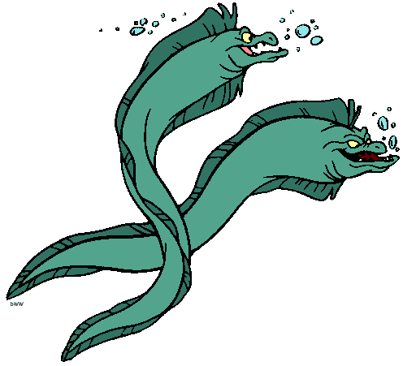

# flotsam-and-jetsam
```
Team: flotsam-and-jetsam
	member: 
		- mshell 
		- Christina
		- Dongjie
	
Challenge: find-the-plastic-flow

- Approaches: Plotting each data point with magnitude and direction over the course of a month.
- Technologies: CARTO.js, CartoCSS
- We were able to accurately show the data relatively but the transition over time is not as visually smooth as we would like it.
- In the future, we could overlay data that tracks the movement of a single object to potentially predict the future position and/or past position of a given object at any location.

```





[link to website](https://goo.gl/fzT2x7)
